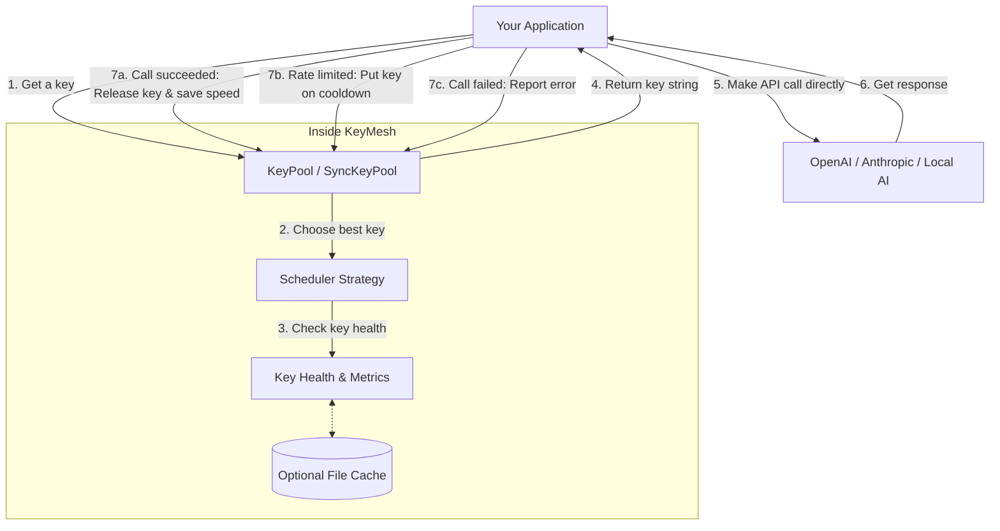
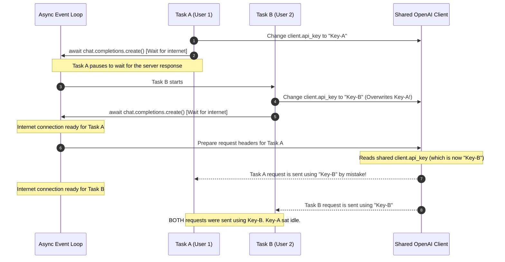

# 🗝️ KeyMesh: Developer Guide & How It Works

### A Simple Guide to Managing Multiple API Keys for AI Applications
**Written in plain, easy-to-read English.**

---

## 📖 What is KeyMesh?

When you build AI apps that make many requests at the same time, you often hit a wall: **Rate Limits** (the `429 Too Many Requests` error). This happens because providers like OpenAI or Anthropic limit how many requests you can make per minute on your API keys.

**KeyMesh** solves this problem. It lets you put multiple API keys into a "pool" (a group). KeyMesh then automatically decides which key to use for each request. This allows you to combine several lower-tier keys to get the high speed of a premium key.

### 🛡️ How KeyMesh is Designed (What it is NOT)

To keep your code fast and simple, KeyMesh follows these basic rules:
1. **No Middleman (No Proxy):** KeyMesh does **not** sit between your code and the internet. It does not send internet requests for you. It only runs locally on your machine and tells your code: *"Use this key next."* This means it adds **zero latency** (it won't slow down your connection).
2. **Works with Any Client:** You do not need any special tools or libraries. You can use standard clients like `openai` or `httpx` directly.
3. **You Control the Request:** KeyMesh gives you a key, you use it to call your AI model, and then you tell KeyMesh if the call succeeded or failed.

---

## 🔄 How it Works (The Request Cycle)

KeyMesh uses a simple three-step cycle: **Acquire (Get) ➔ Execute (Run) ➔ Report (Update).**

### 1. The Simple Request Cycle



---

## ⚡ Quick Start: How to Use KeyMesh

You can install KeyMesh easily using `pip` or `uv`:

```bash
# Using uv (recommended)
uv add keymesh

# Using standard pip
pip install keymesh
```

### ⚡ Three Ways to Use KeyMesh (Based on `example.py`)

KeyMesh provides three flexible ways to use your API keys safely. You can choose the approach that best fits your codebase, using either synchronous (sync) or asynchronous (async) code.

---

### Approach 1: Request-Scoped Client Overrides (using `with_options`)
This is the recommended approach for modern SDKs. It safely copies your client configuration for each request while sharing the underlying internet connection pool.

#### 1. Asynchronous Pattern (Async)
```python
import time
from openai import AsyncOpenAI
from keymesh import KeyPool

# Initialize client once
async_client = AsyncOpenAI(base_url=BASE_URL)

async def run_async_with_options(pool: KeyPool) -> None:
    try:
        # Get key from pool
        key = await pool.acquire()
        start = time.monotonic()
        try:
            # Create a safe request-scoped client reference
            scoped_client = async_client.with_options(api_key=key)
            response = await scoped_client.chat.completions.create(
                model=MODEL_NAME,
                messages=[{"role": "user", "content": "Say 'Options Async' in 3 words."}],
            )
            # Release key and log speed
            await pool.release(key, latency=time.monotonic() - start)
            print(f"Success: {response.choices[0].message.content}")
        except BaseException:
            await pool.mark_failed(key)
            raise
    except Exception as e:
        print(f"Failed: {e}")
```

#### 2. Synchronous Pattern (Sync)
```python
import time
from openai import OpenAI
from keymesh import SyncKeyPool

# Initialize client once
sync_client = OpenAI(base_url=BASE_URL)

def run_sync_with_options(pool: SyncKeyPool) -> None:
    try:
        # Get key synchronously
        key = pool.acquire()
        start = time.monotonic()
        try:
            scoped_client = sync_client.with_options(api_key=key)
            response = scoped_client.chat.completions.create(
                model=MODEL_NAME,
                messages=[{"role": "user", "content": "Say 'Options Sync' in 3 words."}],
            )
            pool.release(key, latency=time.monotonic() - start)
            print(f"Success: {response.choices[0].message.content}")
        except BaseException:
            pool.mark_failed(key)
            raise
    except Exception as e:
        print(f"Failed: {e}")
```

---

### Approach 2: Per-Request Custom Headers (using `extra_headers`)
This approach passes the key directly inside the headers of each individual call, keeping the shared client configuration completely untouched.

#### 1. Asynchronous Pattern (Async)
```python
async def run_async_headers(pool: KeyPool) -> None:
    try:
        key = await pool.acquire()
        start = time.monotonic()
        try:
            # Pass the Authorization header dynamically per-request
            response = await async_client.chat.completions.create(
                model=MODEL_NAME,
                messages=[{"role": "user", "content": "Say 'Headers Async' in 3 words."}],
                extra_headers={"Authorization": f"Bearer {key}"}
            )
            await pool.release(key, latency=time.monotonic() - start)
            print(f"Success: {response.choices[0].message.content}")
        except BaseException:
            await pool.mark_failed(key)
            raise
    except Exception as e:
        print(f"Failed: {e}")
```

#### 2. Synchronous Pattern (Sync)
```python
def run_sync_headers(pool: SyncKeyPool) -> None:
    try:
        key = pool.acquire()
        start = time.monotonic()
        try:
            response = sync_client.chat.completions.create(
                model=MODEL_NAME,
                messages=[{"role": "user", "content": "Say 'Headers Sync' in 3 words."}],
                extra_headers={"Authorization": f"Bearer {key}"}
            )
            pool.release(key, latency=time.monotonic() - start)
            print(f"Success: {response.choices[0].message.content}")
        except BaseException:
            pool.mark_failed(key)
            raise
    except Exception as e:
        print(f"Failed: {e}")
```

---

### Approach 3: Lifecycle Hooks (using Context Managers)
This is the safest approach. It automatically wraps getting, timing, releasing, and error handling of a key in a Python context manager block. This guarantees your keys are always returned and never leak.

#### 1. Asynchronous Pattern (Async)
```python
import contextlib
from typing import AsyncGenerator
from openai import RateLimitError

@contextlib.asynccontextmanager
async def async_key_lifecycle(pool: KeyPool) -> AsyncGenerator[str, None]:
    key = await pool.acquire()
    start = time.monotonic()
    try:
        yield key
        await pool.release(key, latency=time.monotonic() - start)
    except RateLimitError:
        await pool.mark_rate_limited(key, cooldown=60.0)
        raise
    except BaseException:
        await pool.mark_failed(key)
        raise

# How to use it:
async def run_async_lifecycle(pool: KeyPool) -> None:
    try:
        async with async_key_lifecycle(pool) as key:
            scoped_client = async_client.with_options(api_key=key)
            response = await scoped_client.chat.completions.create(
                model=MODEL_NAME,
                messages=[{"role": "user", "content": "Say 'Lifecycle Async' in 3 words."}],
            )
            print(f"Success: {response.choices[0].message.content}")
    except Exception as e:
        print(f"Failed: {e}")
```

#### 2. Synchronous Pattern (Sync)
```python
import contextlib
from typing import Generator
from openai import RateLimitError

@contextlib.contextmanager
def sync_key_lifecycle(pool: SyncKeyPool) -> Generator[str, None, None]:
    key = pool.acquire()
    start = time.monotonic()
    try:
        yield key
        pool.release(key, latency=time.monotonic() - start)
    except RateLimitError:
        pool.mark_rate_limited(key, cooldown=60.0)
        raise
    except BaseException:
        pool.mark_failed(key)
        raise

# How to use it:
def run_sync_lifecycle(pool: SyncKeyPool) -> None:
    try:
        with sync_key_lifecycle(pool) as key:
            scoped_client = sync_client.with_options(api_key=key)
            response = scoped_client.chat.completions.create(
                model=MODEL_NAME,
                messages=[{"role": "user", "content": "Say 'Lifecycle Sync' in 3 words."}],
            )
            print(f"Success: {response.choices[0].message.content}")
    except Exception as e:
        print(f"Failed: {e}")
```

---

## 🧬 Important Safety Rules (How KeyMesh Avoids Bugs)

KeyMesh is built to prevent database or memory corruption when many tasks run at the exact same time.

### 1. Internal Safety Locks
* **Async (`KeyState`):** Whenever KeyMesh updates a key's details (like how many times it was used), it uses a helper called `asyncio.Lock` to make sure only one task can write to it at a time.
* **Sync (`SyncKeyState`):** For standard multi-threaded code, KeyMesh uses `threading.Lock` to keep your variables safe from being corrupted.

### 2. Non-Blocking Breaks (Cooldowns)
When an API key gets rate-limited, KeyMesh puts it on "cooldown." Instead of making your whole app pause or sleep, KeyMesh simply skips that key and immediately uses another available one. Your app keeps running at full speed.

### 3. Measuring Key Speed (EMA)
To know which key is the fastest, KeyMesh calculates a running average of response times. Instead of letting one slow network spike ruin a key's score, it uses a formula called **EMA (Exponential Moving Average)** with a default value of `0.2`. 

This formula blends the new speed with past speeds to keep score tracking fair and smooth.

---

## 🧬 How to Prevent the "Race Condition" Bug

> [!CAUTION]
> **The Key-Mixing Bug (Race Condition)**
> If you have a single shared `client` instance and change its key directly in a loop (`client.api_key = key`), you will experience a critical bug where keys get mixed up!

### 1. Why do keys get mixed up?

In asynchronous frameworks or multi-threaded environments, tasks run simultaneously:



To fix this, **never** change the global `client.api_key`. Instead, use one of these three simple solutions:

### Solution 1: Use Scoped Copies (`with_options`)
This creates a quick copy of your client config with a specific key. Both copies still share the same underlying connection pool, so it is extremely fast and safe.

```python
# Initialize client once
client = AsyncOpenAI()

async def run_safe(pool: KeyPool):
    key = await pool.acquire()
    start = time.monotonic()
    try:
        # with_options is thread-safe and scoped to this block
        scoped_client = client.with_options(api_key=key)
        
        response = await scoped_client.chat.completions.create(
            model="gpt-4",
            messages=[{"role": "user", "content": "Hello!"}]
        )
        await pool.release(key, latency=time.monotonic() - start)
    except Exception:
        await pool.mark_failed(key)
        raise
```

### Solution 2: Send the Key in Request Headers
You can pass the key directly inside the request headers of each individual call.

```python
async def run_with_headers(pool: KeyPool):
    key = await pool.acquire()
    start = time.monotonic()
    try:
        # Pass the key in headers
        response = await client.chat.completions.create(
            model="gpt-4",
            messages=[{"role": "user", "content": "Hello!"}],
            extra_headers={"Authorization": f"Bearer {key}"}
        )
        await pool.release(key, latency=time.monotonic() - start)
    except Exception:
        await pool.mark_failed(key)
        raise
```

### Solution 3: Use Context Managers (Golden Path)
If you forget to call `pool.release()`, your key can get stuck in a "busy" state forever. To prevent this, use Python context managers. They guarantee that keys are always returned to the pool, even if your code crashes.

```python
import time
import contextlib
from typing import AsyncGenerator
from openai import RateLimitError
from keymesh import KeyPool

@contextlib.asynccontextmanager
async def use_key(pool: KeyPool) -> AsyncGenerator[str, None]:
    # 1. Get key
    key = await pool.acquire()
    start_time = time.monotonic()
    try:
        yield key
        # 2. Release key on success
        latency = time.monotonic() - start_time
        await pool.release(key, latency=latency)
    except RateLimitError:
        # 3. Handle rate limits
        await pool.mark_rate_limited(key, cooldown=60.0)
        raise
    except Exception:
        # 4. Handle other errors
        await pool.mark_failed(key)
        raise
```

**How to use it:**
```python
# The context manager automatically cleans up and releases the key
async with use_key(pool) as key:
    scoped_client = client.with_options(api_key=key)
    response = await scoped_client.chat.completions.create(...)
```

---

## 🔌 Advanced Setup: Using Different AI Providers

A powerful feature of KeyMesh is pooling keys from **different providers** (like SiliconFlow, OpenRouter, DeepInfra, or local tools like Ollama and LM Studio) to run the same models.

### 1. The Configuration Schema
Create a simple dictionary mapping each API key to its provider and model settings:

```python
providers_config = {
    "sk-siliconflow-key": {
        "provider": "siliconflow",
        "base_url": "https://api.siliconflow.cn/v1",
        "model": "MiniMaxAI/MiniMax-M2.5",
    },
    "sk-openrouter-key": {
        "provider": "openrouter",
        "base_url": "https://openrouter.ai/api/v1",
        "model": "minimax/minimax-m2.7",
    },
    "sk-lmstudio-local-key": {
        "provider": "lmstudio",
        "base_url": "http://localhost:1234/v1",
        "model": "MiniMaxAI/minimax-m2",
    }
}
```

### 2. Implementation: Dynamic Routing Pattern
When a key is acquired from the pool, use it to look up the correct provider URL and model dynamically:

```python
import asyncio
import time
from openai import AsyncOpenAI
from keymesh import KeyPool

async def run_dynamic_route(pool: KeyPool, config: dict, prompt: str):
    # 1. Get the key
    key = await pool.acquire()
    start_time = time.monotonic()
    
    # 2. Look up provider settings mapped to this key
    meta = config.get(key)
    if not meta:
        await pool.mark_failed(key)
        raise ValueError("Key metadata missing!")
        
    base_url = meta["base_url"]
    model_name = meta["model"]
    provider = meta["provider"]
    
    print(f"Routing request to {provider} at {base_url}")
    
    # 3. Create a temporary client for this provider
    client = AsyncOpenAI(base_url=base_url, api_key=key)
    
    try:
        # 4. Make the call
        response = await client.chat.completions.create(
            model=model_name,
            messages=[{"role": "user", "content": prompt}]
        )
        latency = time.monotonic() - start_time
        await pool.release(key, latency=latency)
        print(f"Success via {provider}: {response.choices[0].message.content[:30]}...")
    except Exception as e:
        if "429" in str(e) or "rate" in str(e).lower():
            await pool.mark_rate_limited(key, cooldown=60.0)
        else:
            await pool.mark_failed(key)
        raise e
```

---

## ✅ Do's and Don'ts (Best Practices)

To keep your application stable, fast, and bug-free under heavy traffic, follow these simple guidelines:

### Do's (Best Practices)
* **DO reuse a single client:** Initialize your `AsyncOpenAI` or `OpenAI` client **once** at application start and reuse it. This keeps connection pools alive and speeds up requests.
* **DO use scoped clients:** Use `client.with_options(api_key=key)` to safely attach a key to a specific request.
* **DO use Context Managers:** Wrap your key calls in context managers (using `try/finally`) to ensure keys are always released back to the pool, even if a request crashes.
* **DO choose JSON storage in production:** Use `JSONStorage` or `SyncJSONStorage` so rate-limit cooldowns and speed records survive when your server restarts.
* **DO set reasonable cooldowns:** A 60-second cooldown is usually perfect. This gives keys a brief break without keeping them out of action for too long.

### Don'ts (Common Mistakes to Avoid)
* **DON'T change the global key:** Never do `client.api_key = key` on a shared client inside parallel loops. This will cause different requests to mix up their keys.
* **DON'T create clients inside functions:** Do not do `client = AsyncOpenAI()` inside your request loop. Creating a client for every single request ruins internet performance.
* **DON'T sleep on rate limits:** If a key hits a rate limit, do not call `time.sleep()`. Let KeyMesh handle the cooldown; it will automatically skip the cooling key and keep your app running.
* **DON'T forget to close the pool:** Always run `await pool.close()` or `pool.close()` when your application shuts down to save statistics safely.
* **DON'T use invalid keys:** Clean up and remove keys that fail repeatedly so KeyMesh does not waste time testing them.

---

## 🛠️ Complete API Quick Reference

### 1. KeyPool (Async) methods

* `pool = KeyPool(keys=["key1", "key2"], strategy=SchedulerStrategy.LEAST_BUSY)`: Creates the pool.
* `key = await pool.acquire()`: Gets the next healthy key.
* `await pool.release(key, latency=0.5)`: Returns the key to the pool and logs how fast it was.
* `await pool.mark_rate_limited(key, cooldown=60.0)`: Puts the key on break for 60 seconds.
* `await pool.mark_failed(key)`: Reports that the key failed to connect.
* `await pool.close()`: Safely saves statistics and shuts down the pool.

### 2. SyncKeyPool (Sync/Threaded) methods

Identical to the async methods but does not require `await`:
* `pool = SyncKeyPool(keys=["key1", "key2"])`
* `key = pool.acquire()`
* `pool.release(key, latency=0.5)`
* `pool.mark_rate_limited(key, cooldown=60.0)`
* `pool.mark_failed(key)`
* `pool.close()`

### 3. Schedulers (Strategies)
* `SchedulerStrategy.ROUND_ROBIN`: Keys take turns one after another.
* `SchedulerStrategy.LEAST_BUSY`: Prioritizes keys with the lowest active workloads.
* `SchedulerStrategy.WEIGHTED`: Prioritizes faster and more successful keys.

### 4. KeyMesh Exceptions
All errors inherit from a main class, making them easy to catch:
```text
KeyMeshError (Base error)
 ├── KeyPoolEmptyError (Raised if you didn't load any keys)
 ├── KeyExhaustionError (Raised if all keys are cooling down or broken)
 └── StorageError (Raised if saving files failed)
```
