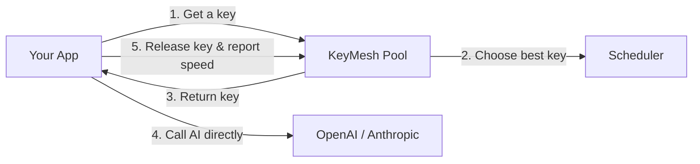

# 🗝️ KeyMesh

**A simple, safe tool to manage and share multiple API keys for AI applications.**

[](https://pyproject.toml)
[](https://opensource.org/licenses/MIT)
[](https://github.com/astral-sh/uv)
[](https://github.com/astral-sh/ruff)
[](https://github.com/python/mypy)

---

## 📖 What is KeyMesh?

KeyMesh is a fast Python tool designed to **share work across multiple API keys** (like OpenAI, Anthropic, Gemini, or OpenRouter). 

By automatically distributing your API requests across a pool of keys, it helps you avoid the annoying **"429 Too Many Requests"** (rate limit) errors. It combines multiple cheap or free keys to give you the speed and capacity of a premium key.

> [!IMPORTANT]
> **Read the Plain-English Guide:**
> For a detailed, easy-to-read explanation of how KeyMesh works, safety rules, and advanced provider setups, see our complete [KEYMESH_DOCUMENTATION.md](file:///Users/rhythamnegi/Code/keymesh-doc/KEYMESH_DOCUMENTATION.md).

---

## ✨ Key Features

* **🚀 High Speed:** Group multiple keys to act as a single high-tier key, maximizing your request capacity.
* **🔌 Zero Network Latency:** KeyMesh does **not** sit between your application and the internet (it is not a proxy). It operates locally on your machine, adding exactly zero delays.
* **🛡️ Safe for Parallel Code:** Works perfectly with both asynchronous (`asyncio`) loops and standard multi-threaded Python code.
* **❄️ Smart Breaks (Cooldowns):** If a key hits a rate limit, KeyMesh takes it out of rotation, gives it a break, and automatically uses other keys.
* **📊 Speed & Health Tracking:** Tracks response times and logs failures to keep your API calls running smoothly.
* **💾 File Saving:** Can automatically save key health data to a local file so your settings survive when your app restarts.

---

## 🔄 How it Works

KeyMesh is very simple: your code asks KeyMesh for the best key, calls the AI provider directly using your favorite library (like `openai`), and then tells KeyMesh if the call worked or failed.



---

## 📦 Installation

KeyMesh is easy to install using your preferred tool:

```bash
# Using uv (highly recommended)
uv add keymesh

# Using standard pip
pip install keymesh
```

---

## ⚡ Quick Start Example (Based on `example.py`)

Here is how you can use KeyMesh's recommended **`with_options`** approach to safely override your key per-request under high concurrency. This copies your client configuration for each request while sharing the underlying connection pool.

```python
import time
import asyncio
from openai import AsyncOpenAI
from keymesh import KeyPool, SchedulerStrategy

# 1. Initialize your client once (shares connection pooling)
async_client = AsyncOpenAI(base_url=BASE_URL)

async def run_async_with_options(pool: KeyPool) -> None:
    try:
        # 2. Get a key from the pool (LEAST_BUSY strategy avoids overloaded keys)
        key = await pool.acquire()
        start = time.monotonic()
        try:
            # 3. Create a safe request-scoped client reference
            scoped_client = async_client.with_options(api_key=key)
            response = await scoped_client.chat.completions.create(
                model=MODEL_NAME,
                messages=[{"role": "user", "content": "Say 'Options Async' in 3 words."}],
            )
            # 4. Release the key and log response speed
            await pool.release(key, latency=time.monotonic() - start)
            print(f"Success: {response.choices[0].message.content}")
        except BaseException:
            # Report failure so KeyMesh can prune dead keys
            await pool.mark_failed(key)
            raise
    except Exception as e:
        print(f"Failed: {e}")

async def main():
    pool = KeyPool(
        keys=["sk-key-1", "sk-key-2", "sk-key-3"],
        strategy=SchedulerStrategy.LEAST_BUSY
    )
    try:
        await run_async_with_options(pool)
    finally:
        await pool.close()

if __name__ == "__main__":
    asyncio.run(main())
```

---

## 🧬 Concurrency Warning: Don't Mix Up Your Keys!

> [!WARNING]
> **Avoid the Key-Mixing Bug (Race Condition)**
> In parallel loops, **never** change the global key attribute of your client directly (`client.api_key = key`). This causes different tasks to overwrite each other's keys mid-request.

Use **Context Managers** to keep your key selections clean, safe, and leak-free:

```python
import time
import contextlib
from typing import AsyncGenerator
from openai import RateLimitError
from keymesh import KeyPool

@contextlib.asynccontextmanager
async def use_key(pool: KeyPool) -> AsyncGenerator[str, None]:
    key = await pool.acquire()
    start_time = time.monotonic()
    try:
        yield key
        await pool.release(key, latency=time.monotonic() - start_time)
    except RateLimitError:
        await pool.mark_rate_limited(key, cooldown=60.0)
        raise
    except Exception:
        await pool.mark_failed(key)
        raise

# How to use safely:
async with use_key(pool) as key:
    scoped_client = client.with_options(api_key=key)
    response = await scoped_client.chat.completions.create(...)
```

For synchronous multi-threaded scripts and setting up keys across different platforms (SiliconFlow, OpenRouter, DeepInfra, Ollama, LM Studio), check out the simple walkthroughs in [KEYMESH_DOCUMENTATION.md](file:///Users/rhythamnegi/Code/keymesh-doc/KEYMESH_DOCUMENTATION.md).

---

## ✅ Quick Do's & Don'ts

| Do's (Best Practices) | Don'ts (Common Mistakes) |
| :--- | :--- |
| **DO** reuse a single client instance to keep network connection pools fast. | **DON'T** change the global `client.api_key = key` attribute in parallel loops. |
| **DO** use `client.with_options(api_key=key)` to copy client configurations safely per request. | **DON'T** create new clients (`client = AsyncOpenAI()`) inside your request loops. |
| **DO** use context managers to guarantee keys are returned to the pool if code crashes. | **DON'T** add delays like `time.sleep()` when a key hits rate limits (let KeyMesh handle it). |
| **DO** use `JSONStorage` in production so key statistics and cooldowns survive server restarts. | **DON'T** forget to call `pool.close()` when your application shuts down. |

---

## 🛠️ Local Development & Tools

KeyMesh uses `uv` for easy environment setup, formatting, and running tests.

```bash
# Set up virtual environment and install dependencies
uv sync

# Run code style formatting & lints
uv run ruff check .

# Check types
uv run mypy .

# Run test suites
uv run pytest
```

---

## 📄 License

KeyMesh is open-source software licensed under the [MIT License](LICENSE).
