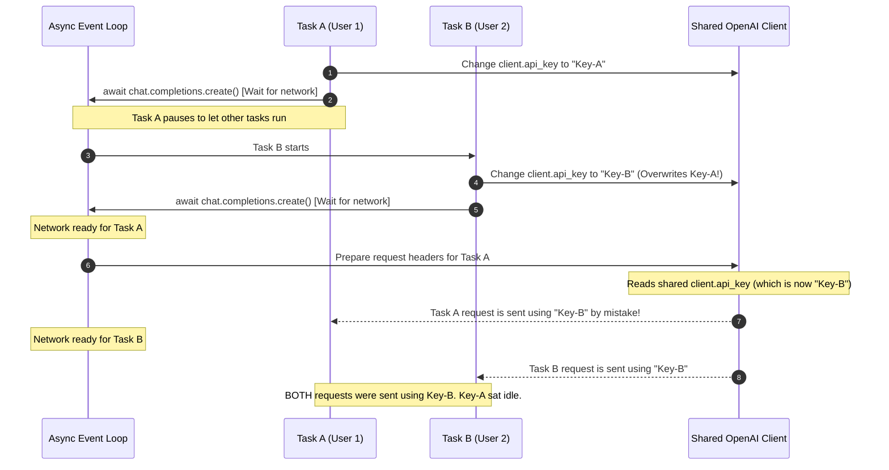

# Preventing Race Conditions

A common pitfall when integrating a key manager with standard AI SDKs (like OpenAI or Anthropic) is mutating client-wide properties globally.

## ⚠️ The Key-Mixing Bug

If you have a single shared `client` instance and change its API key in place inside parallel request loops, you will suffer from race conditions where requests use the wrong keys:

```python
# 🚫 BUGGY ANTI-PATTERN: DO NOT DO THIS
async def call_api(pool: KeyPool):
    key = await pool.acquire()
    try:
        client.api_key = key # ❌ Global mutation!
        response = await client.chat.completions.create(...)
        await pool.release(key)
    except Exception:
        await pool.mark_failed(key)
```

### 🚨 Detailed Race Condition Lifecycle

Here is exactly how requests get mixed up when mutating the client globally:



---

## 🛠️ The Fix

To ensure concurrency-safe executions, you must pass credentials dynamically per request. Do **not** mutate the shared client globally. 

Instead, use one of the following safe approaches:
1. **Scoped Client Overrides** (creating request-scoped configs via `with_options`).
2. **Request Headers injection** (injecting headers per call via `extra_headers`).
3. **Automated Lifecycles** (wrapping variables in context managers).

Review the next section for detailed code implementations of these solutions.
