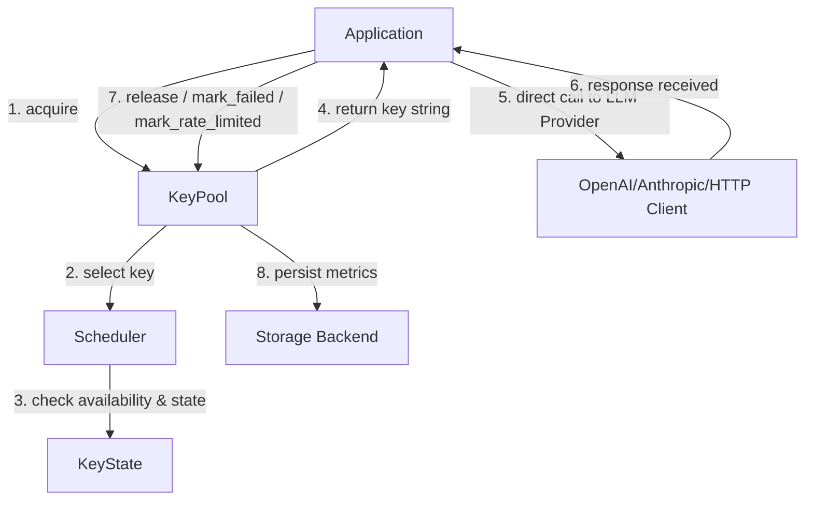
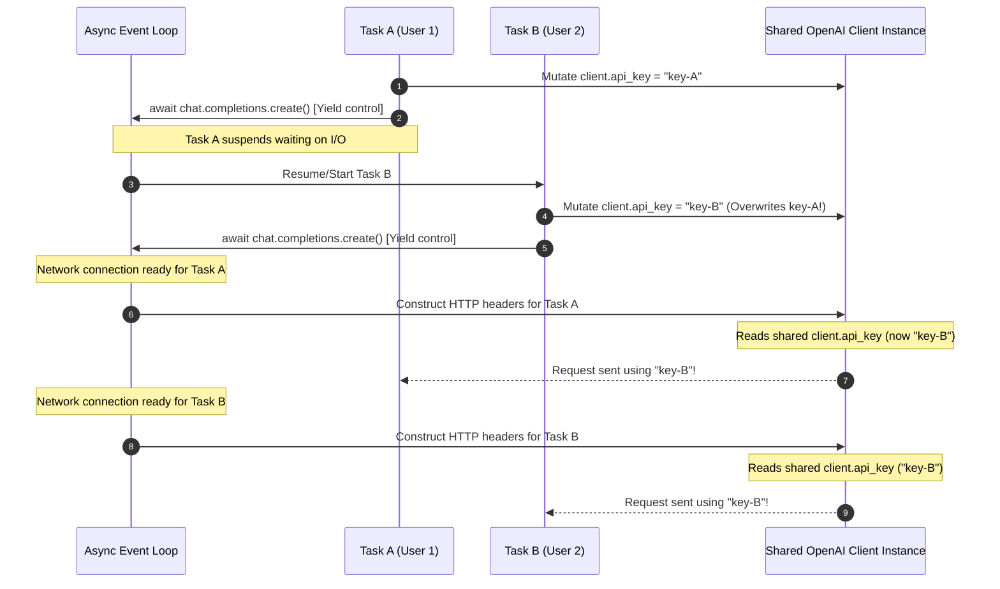

Why Keymesh Exist ?
It happens to every developer building with large language models (LLMs): 
you write your asynchronous loops, launch a concurrent batch of queries for your AI agent, and immediately hit a wall with an openai.RateLimitError: Error code: 429. When building prototypes or running highly concurrent workloads on free or lower-tier API keys from providers like OpenAI, Anthropic, or Gemini, you are bound by strict rate limits and token-per-minute caps. While upgrading to higher tiers is the ultimate fix, it often requires substantial prepayment. 
For developers who want to build, test, and scale applications immediately without paying upfront enterprise gateway premiums, navigating these concurrency restrictions requires smart, code-level rate-limiting and optimization strategies. So, how do you combine three lower-tier keys to act as one high-throughput pool?

## Meet KeyMesh

If you want a bulletproof, production-grade credential pool manager, you don't have to write your own locks. That's exactly why **KeyMesh** was built.

**KeyMesh** is a lightweight, concurrency-safe credential orchestration runtime for AI systems. It stay entirely out of your network stack—it doesn't wrap your OpenAI/Anthropic client, intercept your HTTP requests, or add proxy latency. It acts purely as a local scheduler to yield keys and record the outcomes of operations.

### How KeyMesh fixes the core issues:
1. **Dynamic Smart Cooldowns**: Skips rate-limited keys dynamically without sleeping or blocking the event loop.
2. **Pluggable Schedulers**: Includes `RoundRobin`, `LeastBusy`, and `Weighted` (probabilistic selection favoring keys with low average latency and high success rates).
3. **Double Interface**: Supports both async native (`KeyPool`) and standard synchronous, thread-safe blocking (`SyncKeyPool`) architectures.
4. **Flexible Persistence**: Built-in Memory and atomic JSON storage backends out-of-the-box, surviving application restarts.

## 🔄 Runtime Flow & Architecture

KeyMesh coordinates credentials via a simple, high-performance async-safe flow:




How to use  :
TODO : write based on the below code.

```python

# Client-Level State Race Conditions in Concurrent API Environments

When multiplexing multiple API keys across highly concurrent workloads (e.g., using `KeyMesh` to load balance requests), sharing a single client instance and mutating its `api_key` property directly causes a critical concurrency bug known as a **Race Condition**.

---

## 1. What is the Race Condition?

A **race condition** occurs when the behavior of a program depends on the relative timing or interleaving of multiple concurrent operations, and they share mutable state.

In the context of the OpenAI SDK, the `OpenAI` and `AsyncOpenAI` client instances are designed to be long-lived objects. If you initialize a single client and dynamically update its `client.api_key` attribute on each request, concurrent threads or async tasks will overwrite the same attribute before other tasks have finished sending their HTTP requests.

---

## 2. Why Does it Happen?

In asynchronous frameworks like Python's `asyncio` or in multi-threaded runtimes, execution is interleaved:

1. **Task A** starts, retrieves `key_A`, and updates the shared client's state: `client.api_key = "key_A"`.
2. **Task A** triggers the network request: `await client.chat.completions.create(...)`. Because this is an asynchronous, I/O-bound operation, Task A yields control back to the event loop.
3. While Task A is waiting for the connection to be established or the server to respond, **Task B** starts running.
4. **Task B** retrieves `key_B`, and updates the *same* shared client's state: `client.api_key = "key_B"`.
5. **Task B** yields control when sending its request.
6. The underlying HTTP handler finally compiles and transmits the HTTP headers for **Task A**. When it reads `client.api_key`, it retrieves the *current* state of the client, which has already been changed to `"key_B"`.
7. **Both Task A and Task B end up making their requests using `key_B`!**

### Sequence of Failure



### Consequences
* **Incorrect Cooldowns / Metrics:** KeyMesh will attribute latency or failure rates to the wrong key. If Task A fails or hits a rate limit, KeyMesh might mark `key_A` as rate-limited, even though `key_B` was actually used for the call.
* **Quota Exhaustion:** Certain keys might be heavily overused while others sit idle.
* **Security & Isolation:** Requests from different users/contexts are sent under arbitrary keys, violating multi-tenant tracking or compliance structures.

---

## 3. What Steps Do We Need to Take?

To run high-concurrency workloads safely, we must ensure **immutable request configuration**. The API key must be bound to the specific request scope rather than the global client scope.

### Step 1: Use `with_options()` for SDK-Managed Overrides
Instead of creating a new client from scratch (which destroys connection pooling) or mutating the shared client, use `client.with_options()`. This creates a lightweight, shallow copy of the client with the updated `api_key` that shares the underlying HTTP connection pool.

```python
# 1. Initialize client ONCE at application startup
client = AsyncOpenAI(base_url=BASE_URL)

async def handle_request(pool: KeyPool):
    # 2. Acquire a load-balanced key from KeyMesh
    key = await pool.acquire()
    start_time = time.monotonic()
    
    try:
        # 3. Create a thread-safe, request-scoped client reference using with_options
        scoped_client = client.with_options(api_key=key)
        
        response = await scoped_client.chat.completions.create(
            model=MODEL_NAME,
            messages=[{"role": "user", "content": "Query text..."}]
        )
        await pool.release(key, latency=time.monotonic() - start_time)
    except Exception as e:
        await pool.mark_failed(key)
```

### Step 2: Use Request-Specific Headers (Alternative)
If `with_options` is not available or you are using custom transport wrappers, pass the key directly inside the headers for each specific call:

```python
response = await client.chat.completions.create(
    model=MODEL_NAME,
    messages=[{"role": "user", "content": "Query text..."}],
    extra_headers={"Authorization": f"Bearer {key}"}
)
```

### Step 3: Implement Lifecycle Hooks (Context Managers)

To avoid duplicating the `try...except...finally` block in every API call, you can encapsulate the entire key lifecycle (acquiring, timing latency, releasing, marking rate-limited, or marking failed) into a **context manager**. 

This guarantees that the key is always correctly returned to the pool regardless of success, network drops, or exceptions, preventing **key leaks** (keys staying in the active state permanently).

#### A. Asynchronous Lifecycle Hook Example
Using `contextlib.asynccontextmanager`:

```python
import time
import contextlib
from openai import OpenAIError, RateLimitError
from keymesh import KeyPool

@contextlib.asynccontextmanager
async def key_lifecycle(pool: KeyPool):
    """
    Context manager to automatically manage acquiring, timing, releasing,
    and error-handling lifecycle of an async API key.
    """
    key = await pool.acquire()
    start_time = time.monotonic()
    try:
        # Hand over the key to the context block
        yield key
        
        # Success hook: release the key and track latency
        latency = time.monotonic() - start_time
        await pool.release(key, latency=latency)
        
    except RateLimitError:
        # Rate limit hook: mark key as rate-limited (e.g. 60s cooldown)
        await pool.mark_rate_limited(key, cooldown=60.0)
        raise
        
    except (OpenAIError, Exception):
        # Failure hook: mark key as failed for connection or SDK errors
        await pool.mark_failed(key)
        raise
```

**Usage:**
```python
# The key is safely acquired, timed, and returned automatically
async with key_lifecycle(pool) as key:
    scoped_client = client.with_options(api_key=key)
    response = await scoped_client.chat.completions.create(
        model=MODEL_NAME,
        messages=[{"role": "user", "content": "Hello!"}]
    )
```

---

#### B. Synchronous Lifecycle Hook Example
Using `contextlib.contextmanager` for synchronous/multi-threaded runtimes:

```python
import time
import contextlib
from openai import OpenAIError, RateLimitError
from keymesh import SyncKeyPool

@contextlib.contextmanager
def sync_key_lifecycle(pool: SyncKeyPool):
    """
    Context manager to automatically manage acquiring, timing, releasing,
    and error-handling lifecycle of a synchronous API key.
    """
    key = pool.acquire()
    start_time = time.monotonic()
    try:
        # Hand over the key to the context block
        yield key
        
        # Success hook: release the key and track latency
        latency = time.monotonic() - start_time
        pool.release(key, latency=latency)
        
    except RateLimitError:
        # Rate limit hook: mark key as rate-limited
        pool.mark_rate_limited(key, cooldown=60.0)
        raise
        
    except (OpenAIError, Exception):
        # Failure hook: mark key as failed
        pool.mark_failed(key)
        raise
```

**Usage:**
```python
# The key is safely managed and returned synchronously
with sync_key_lifecycle(pool) as key:
    scoped_client = client.with_options(api_key=key)
    response = scoped_client.chat.completions.create(
        model=MODEL_NAME,
        messages=[{"role": "user", "content": "Hello!"}]
    )
```


```

List separate example of different OpenAI compatible API providers.

## Use case how we use this to use same llm models from different provider like.

```secrets.py

Here is the configuration represented as a native Python list of dictionaries, ready to be dropped into your code or dumped directly into a JSON file.
Python

providers_config = [
    {
        "sk-siliconflow-m1n1max7x8y9z": {
            "provider": "siliconflow",
            "base_url": "https://api.siliconflow.cn/v1",
            "model": "MiniMaxAI/MiniMax-M2.5",
        }
    },
    {
        "sk-openrouter-mm27abc123": {
            "provider": "openrouter",
            "base_url": "https://openrouter.ai/api/v1",
            "model": "minimax/minimax-m2.7",
        }
    },
    {
        "sk-lmstudio-local-m2key": {
            "provider": "lmstudio",
            "base_url": "http://localhost:1234/v1",
            "model": "MiniMaxAI/minimax-m2",
        }
    },
    {
        "sk-ollama-local-m25key": {
            "provider": "ollama",
            "base_url": "http://localhost:11434/v1",
            "model": "minimax-m2.5:latest",
        }
    },
    {
        "hf_huggingface_inference_api_key": {
            "provider": "huggingface",
            "base_url": "https://api-inference.huggingface.co/models",
            "model": "MiniMaxAI/MiniMax-M2.5",
        }
    },
    {
        "sk-deepinfra-oss-xyz987": {
            "provider": "deepinfra",
            "base_url": "https://api.deepinfra.com/v1/openai",
            "model": "deepseek-ai/DeepSeek-R1",
        }
    },
]

# Quick snippet if you need to export it directly to a .json file:
# import json
# with open("api_config.json", "w") as f:
#     json.dump(providers_config, f, indent=4)

```

Use this to get provider details use diffrent provider together.

And many more usage.
